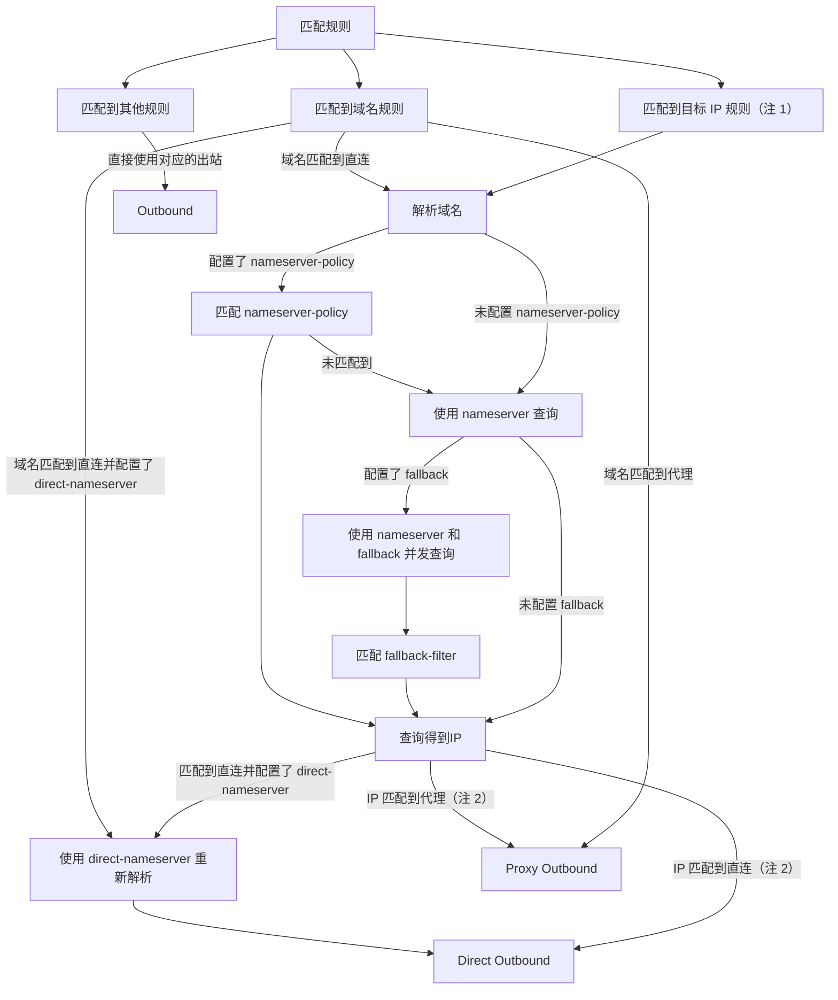
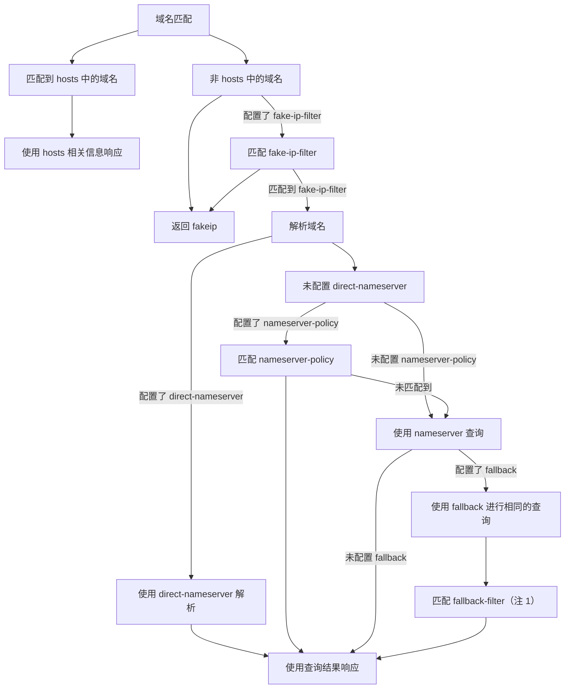

# Mihomo 心智模型

> 未完待续

# 路由系统

路由系统匹配代理请求的元数据，然后使用路由规则对应的 Outbound 出站

请求元数据

- 代理请求目标地址信息：IP, Domain, Port
- 代理请求来源地址信息：IP, Port
- Inbound 相关
  - 类型，也就是 listeners 类型：tun, vless, socks 等
  - port，也就是 listener 的端口
  - user，也就是 listener 中的用户
  - name，也就是 listener 中的 name
  - listener 参见 https://wiki.metacubex.one/config/inbound/listeners/
- UID： Linux 上的 UID
- 进程相关（name, path）
- 网络流量类型：TCP 或者 UDP
- DSCP

注

- 1：如果匹配的是 IP 类型的路由规则，那么会进行域名，然后判断解析结果是否匹配该 IP 规则，如果添加上 no-resolve 则直接跳过
  - 什么是 IP 类型的路由规则？参考 FQA Q1
- 2：这里解析的 Ip 会从头进行一次新的路由规则匹配，且最终的请求地址会变成 IP（待确认）

# DNS 系统

本地电脑上发起一次 DNS 查询

注

- 1：此时，有两个查询结果 nameserver 和 fallback ，如果 nameserver 符合 fallback-filter ，则使用 fallback 的查询结果 

# FQA

## Q1 什么 IP 类型的路由规则？
